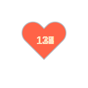

# iBeats
Apple Watch 心率数据采集 - Your Soul, Your Beats!

<!--START_SECTION:my_heart_rate-->
| Time | Rate | 
 | ---- | ---- | 
| 2022年1月10日 16:37 | 67 |
| 2022年1月10日 16:33 | 78 |
| 2022年1月10日 16:30 | 80 |
| 2022年1月10日 16:24 | 72 |
| 2022年1月10日 16:22 | 85 |
| 2022年1月10日 16:14 | 65 |
| 2022年1月10日 16:09 | 60 |
| 2022年1月10日 15:53 | 57 |
| 2022年1月10日 15:34 | 59 |
| 2022年1月10日 15:32 | 58 |
| 2022年1月10日 15:28 | 63 |
| 2022年1月10日 15:23 | 66 |

<!--END_SECTION:my_heart_rate-->

Fork From https://github.com/yihong0618/iBeats .

# 步骤

1. 参考 @L1cardo 分享的[捷径](https://www.icloud.com/shortcuts/6ab6047b459c41ad822ad6b94b1c03d4)
2. 跑完 Actions 之后生成的 svg 引用到自己的 README 或 profile 中，我的[例子](https://github.com/yihong0618)

# 注意事项

注意替换 GitHub API 路径，https://api.github.com/repos/{owner}/{reps}/actions/workflows/{workflow.yml}/dispatches 。

其中 workflow.yml 为 workflow 文件名。

# 特别感谢
- @[wuhan005](https://github.com/wuhan005) 特别棒的项目 [mebeats](https://github.com/wuhan005/mebeats)
- @[L1cardo](https://github.com/L1cardo) idea
- @[yihong](https://github.com/yihong0618)

# 赞赏

谢谢就够了
